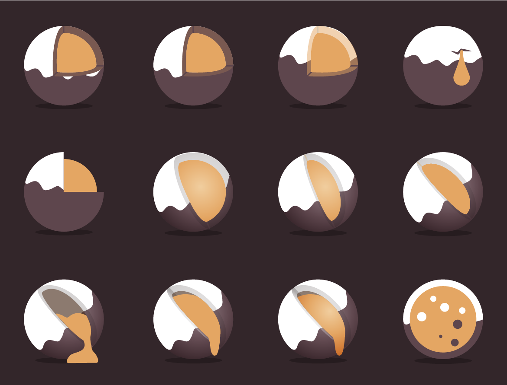
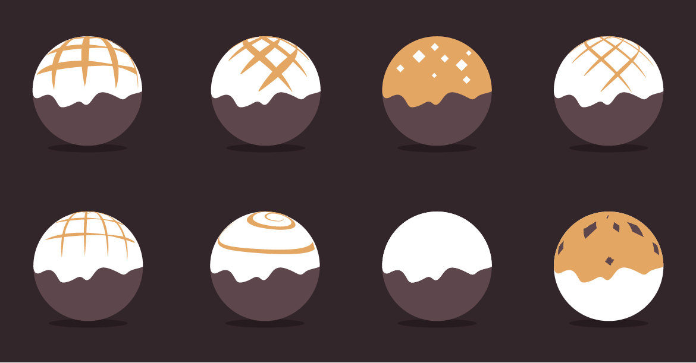
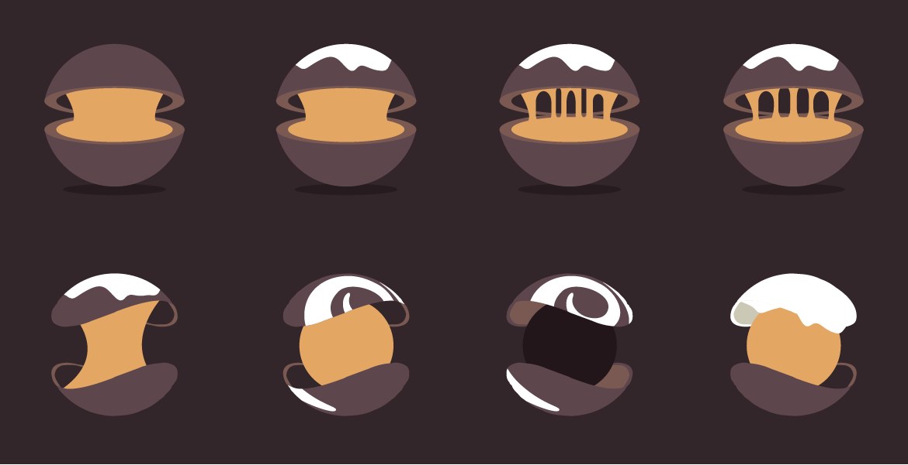
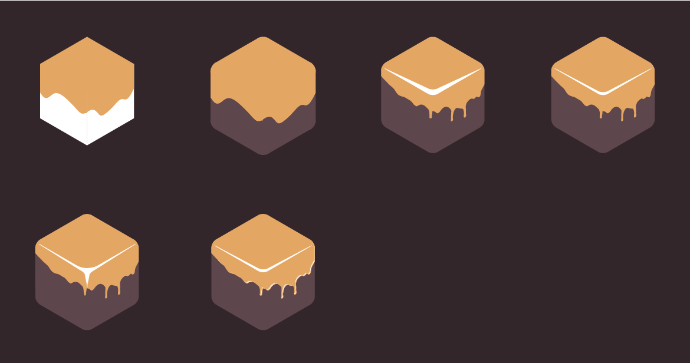
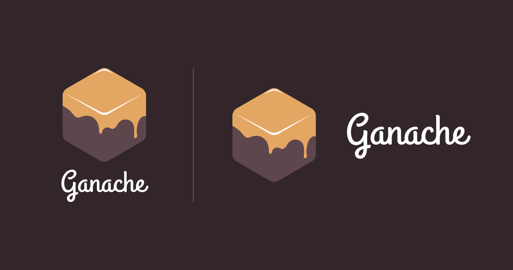

**Note**: Reposted from the Truffle Suite blog because that page is archived.

---

Last week we released [Ganache](https://archive.trufflesuite.com/docs/ganache/), a personal blockchain for Ethereum development. Many of you commented on the design of the landing page and logo, but just how did the gooey cube come to be? Let's take a trip through the 30+ iterations that led to our newest confection.

Before setting out on our design journey, we started with some loose guidelines:

- The new logo should be round and have some dimensionality to keep it consistent with the Truffle logo.
- The colors should consist of chocolate, an accent color and white.

The concepts we explored can be roughly broken down into 4 categories: Core Cutaways, Toppings, Gooey Cores and Soft Blocks.

## Core Cutaways

The first set of core cutaways was an attempt to convey that Ganache, as a local development blockchain, was the "core" of your development workflow. They also depict a ganache filled truffle candy of varying viscosities.

It was toward the end of this stage we qualified one of our initial guidelines. The logo's dimensionality should be represented purely by shape--no gradients!

**Fun fact**: We considered one of the third row, second and third column concepts as a final candidate, but scrapped it when Tim's wife said it looks like a banana slug floating in space. My baby, a slug?! A great reminder to not get too attached before getting feedback!

## Toppings

Questions about the ability of the core cutaways to translate to flat color, as well as being dimensionally mismatched with the Truffle logo caused us to consider a simpler approach; a spherical candy with ganache on the outside. Overall these failed to look interesting and had the opposite problem in that they weren't dimensional enough.

## Gooey Cores

Not satisfied with the topping options we pressed on and attempted the core concept again, this time with some fancier cutaways. While they stood on their own, they were too wide a departure from the Truffle logo. This lack of cohesion lead to a realization that would be our design breakthrough.

## Soft Blocks

Letting go of our assumption that the shape should be round unlocked a series of designs that eventually led to our final logo. To achieve a more interesting drip pattern, we traced and combined different stages of glaze dripping down a cake. It became apparent that this approach was interesting, but made an overly detailed drip pattern which we later simplified for the final. We also tried a few different treatments of the candy's reflection. Check out that longhorn steer in the lower-left!

## The Final Logo

Success! After reconsidering some assumptions and solidifying others, we arrived at our final design. The final logo has both a compelling design and the following qualities that made it a winner:

- The colors consist of chocolate, an accent color and white; a guideline we'll keep going forward.
- It's metaphorically grounded in the product it represents--it's a block, after all!
- The gooey consistency and soft, rounded corners represent the intimidating technical concept of a blockchain in a friendly and approachable way.

We had a blast iterating this logo and Ganache itself. We hoped you learned from our experience and maybe picked up some of your own inspiration along the way. **Happy illustrating!**

-- Josh & the Truffle Team
